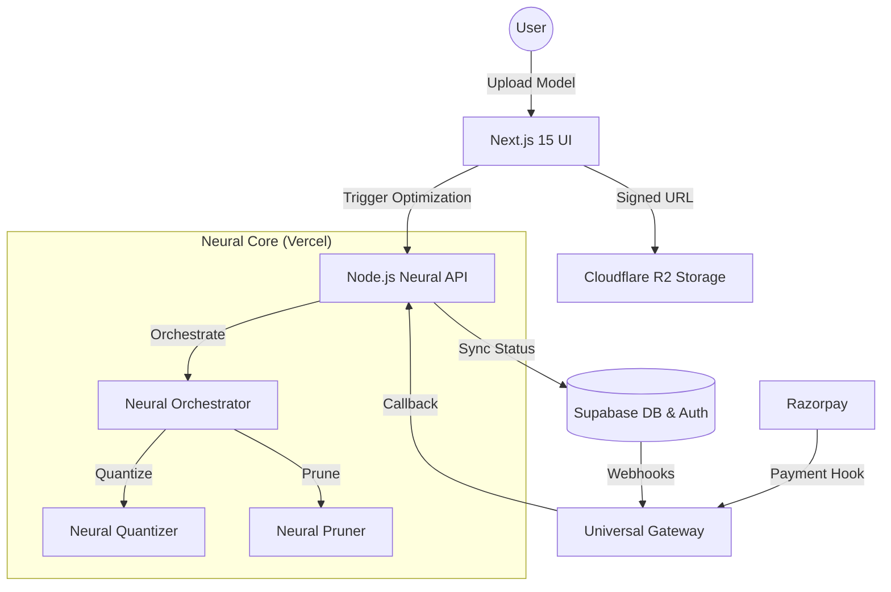

# 🧬 Edge AI Platform: Neural Compression Grid

Edge AI Platform is an elite, high-performance SaaS engine designed to shard, optimize, and deploy neural networks at the edge with precision. Now fully hardened and **Vercel-native**, it provides a unified Node.js/TypeScript architecture for zero-maintenance deployments.

---

## 🏗️ System Architecture

Our platform utilizes a highly optimized **Vercel-native Architecture**. By consolidating the "Neural Core" into Next.js API routes, we eliminate the need for complex hybrid server management while maintaining professional-grade modularity.



---

## ⚡ Core Features

- **Hardened Neural Core**: A modular TypeScript engine featuring specialized Quantization (INT4/INT8) and Pruning services.
- **Universal Callback Gateway**: A single endpoint (`/api/gateway`) that multiplexes Auth, Payments, and Webhooks.
- **Neural Matrix UI**: High-end glassmorphic dashboard built with React 19, GSAP, and Framer Motion.
- **Atomic Credit Engine**: Real-time payment reconciliation via Razorpay and Supabase RPCs.
- **Global Ingest Protocol**: Secure SHA-256 fingerprinting and pre-signed R2 uploads.

---

## 🛠️ Tech Stack

- **Framework**: Next.js 15 (App Router, React 19).
- **Language**: TypeScript 5+ (Strict Mode).
- **Database/Auth**: Supabase (PostgreSQL, RLS Hardened).
- **Logic Validation**: Zod (Contract-First API).
- **Animation**: GSAP (Scroll-Sync), Framer Motion.
- **Storage**: Cloudflare R2 (S3-Compatible).
- **Payments**: Razorpay Integration.

---

## 🚀 Getting Started

### 1. Clone & Initialize
```bash
git clone https://github.com/darshitp091/Edge-AI.git
cd Edge-AI
npm install
```

### 2. Neural Synthesis (Environment)
Copy `.env.example` to `.env` and populate your credentials from Supabase, Razorpay, and Cloudflare R2.
```bash
cp .env.example .env
```

### 3. Database Synchronization
Apply the migration from `supabase/migrations/` to your Supabase SQL Editor to initialize the `profiles`, `models`, and `jobs` tables with their respective RLS policies and RPC functions.

### 4. Boot the Neural Grid
```bash
npm run dev
```
Visit `http://localhost:3000` to access the neural dashboard.

---

## 🛡️ Production Deployment
Targeting **Vercel**? Just push to your `main` branch. 
The platform handles the rest. For detailed configuration of external callbacks, refer to the [API Setup Guide](api_setup_guide.md).

---
*Status: Production Hardened | Powered by Edge AI Neural Core v2.0*
